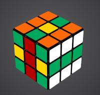

# rsolver-app

## 9 Jan 2023
Added ability to click on individual cubies to change their color. Ran into a painful
firefox CSS bug in which the background scene was preventing clicks on some of the cubies because
it was "in front of" those cubies after 3d rotations. Moved transform-style: preserve 3d from background
to cube and it fixed the problem.
-------------

Demonstration app of a Rubiks cube solver. The home page presents a graphical 3-D cube in default solved
configuration. The 2 lines of movement buttons below the cube `UDLRFBMSE`, and so on, allow
you to move the cube's slices or (in the case of `XYZ`) rotate the entire cube.

Lowercase letters indicate clockwise movement; uppercase letters indicate counterclockwise movement.

The slice names are as follows:

- *u* Up
- *d* Down
- *l* Left
- *r* Right
- *f* Front
- *b* Back
- *m* middle (between Left and Right)
- *s* middle (between Front and Back)
- *e* middle (between Up and Down)

## Functions

The six buttons below allow the following functions:

- *Load Default Cube*  Loads the default solved configuration, overwriting the currently displayed cube.
- *Save Cube*  Saves the currently displayed cube on the server
- *Restore Cube*  Restores the server-saved cube, overwriting the currently displayed cube.
- *Normalize Cube*  Rotates the entire cube to the normalized position. Note that the center cubes
on each face never change their relative orientation to one another. Normlized position is:

    -- Up (Yellow), Down (White), Left (Blue), Right (Green), Front (Red), Back (Orange)

- *Randomize*  Creates a "randomized" set of moves to scramble the cube. The list is displayed
just below in the "Move List"
- *Solve*  Calculates a set of moves to solve a scrambled cube and displays it in the "Move List." Note: a cube must be in the Normalized position to be solved.

## Move List

The Move List displays the moves calculated by the Randomize and Solve functions. You can play the entire
list in sequence or single-step through them.

## Import Cube Description

These six input boxes allow you to type in a specific cube configuration, for example, to allow you
to solve a physical cube in scrambled position. First, note the cube's original orientation.
Then, starting with Up face and using moves along one dimension only, rotate the entire cube so the Up face
becomes the Front face (this would use a `X` move in the terminology above). Describe the nine cubies
of the (now Front) face using the first letters of their colors, moving first left to right and then
up to down.

So the three visible faces of this cube would be described as follows:

- Up:     ogooyoogo
- Front:  grgyrygrg
- Right:  wwwgggwww

## Attributions

[Omelyan's codepen page](https://codepen.io/Omelyan/pen/BKmedK) inspired some of the html, css, and js
code to draw and animate the cube.

The rubik's solver code is Copyright (c) 2017 by Victor Cabezas and is used pursuant to the MIT License. See
[this github page](https://github.com/Wiston999/python-rubik). It uses (among others)
the [Kociemba method](https://www.speedsolving.com/wiki/index.php/Kociemba%27s_Algorithm).
